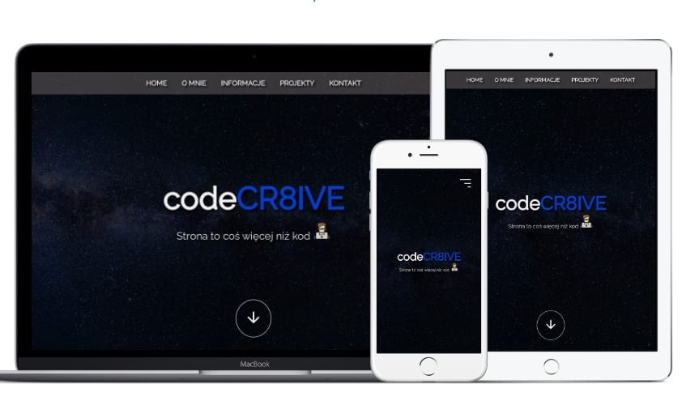

# CodeCr8ive - portfolio website

Welcome to my personal portfolio website! This website showcases my work and provides information about me. It's a project built with HTML, SASS, and JavaScript, and I've used Gulp to streamline the development and build process.

## Features 

- **Responsive Design:** My portfolio is designed to look great on a variety of devices and screen sizes.
- **Project Showcase:** I've included a gallery of my projects, complete with descriptions and links.
- **Contact Information:** You can easily get in touch with me through the provided contact information.

## Technologies Used

- HTML 
- SASS (SCSS)  
- JavaScript  
- Gulp 

## How to Run Locally 

1. Clone this repository: `git clone https://github.com/WojciechStancel/CodeCr8ive.git`
2. Navigate to the project directory: `cd CodeCr8ive`
3. Make sure that you have node.js installed 
4. Install project dependencies: `npm install`
5. Build the project: `gulp`
6. Then `index.html` will open in your browser to view locally.

## Usage

Feel free to use this project as a template for your own portfolio website. Simply replace my content with your own and tailor it to your needs.

## Contact

You can reach me at [kontakt@codecr8ive.pl](mailto:kontakt@codecreative..pl) or visit my website at [www.codecr8ive.pl](http://www.codecr8ive.pl).

Thank you for checking out my portfolio website! 
